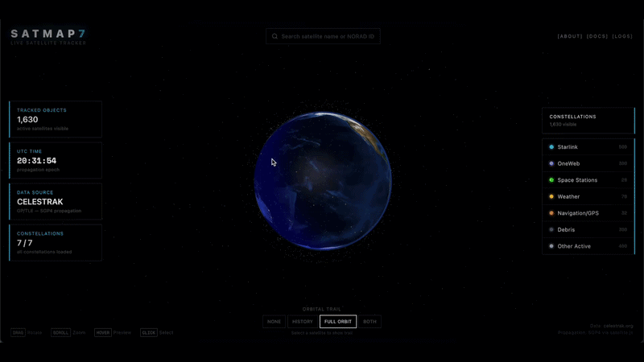
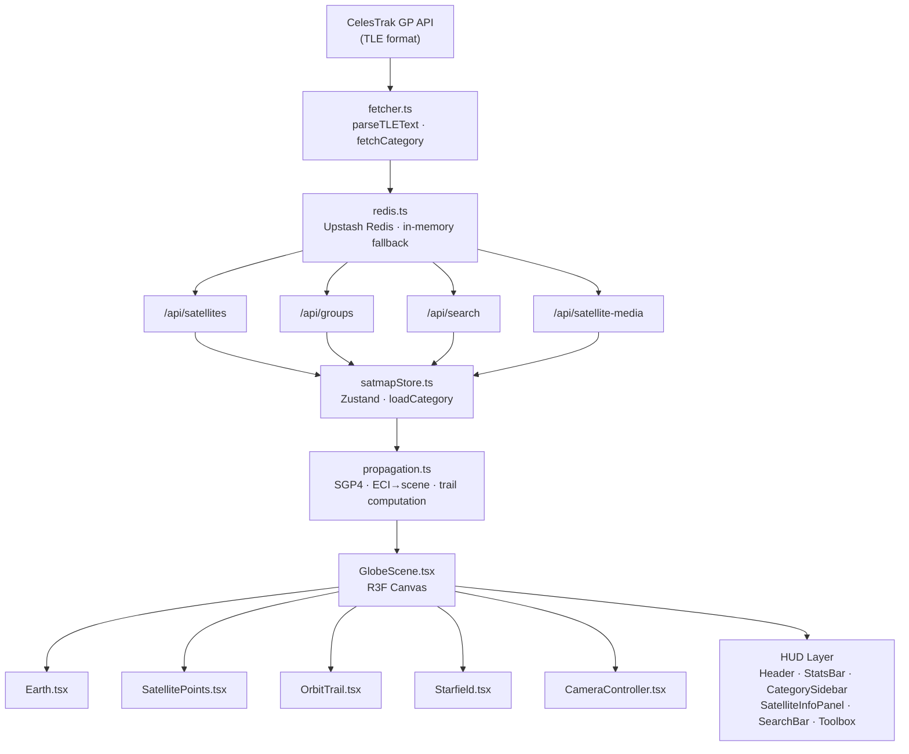

<div align="center">

# SATMAP7

<p align="center">
  
  
  
  
</p>

<p align="center">
  
  
  
  
  
</p>

</div>

<p align="center">
  
</p>

A real-time 3D satellite tracker rendered on an interactive WebGL globe. SATMAP7 pulls live Two-Line Element (TLE) data from CelesTrak, propagates thousands of satellite positions client-side using the SGP4 algorithm, and renders them across 7 color-coded constellations on a photorealistic Earth — all at 60 fps.

<details>
<summary><b>Table of Contents</b></summary>

- [Overview](#overview)
- [Features](#features)
- [Tech Stack](#tech-stack)
- [Architecture](#architecture)
- [Quick Start](#quick-start)
- [Environment Variables](#environment-variables)
- [Scripts](#scripts)
- [Project Structure](#project-structure)
- [Caching](#caching)
- [Satellite Categories](#satellite-categories)
- [Deployment](#deployment)
- [Known Issues](#known-issues)
- [Roadmap](#roadmap)

</details>

---

## Overview

SATMAP7 is a full-stack Next.js application that visualizes Earth's orbital environment in the browser. The server fetches TLE data from [CelesTrak](https://celestrak.org), normalizes and caches it through a three-layer caching system (Next.js fetch revalidation → Upstash Redis → in-memory fallback), then exposes it via a set of typed API routes. The client receives satellite records, runs SGP4 propagation on every animation frame, and maps each satellite's ECI coordinates into Three.js scene space — producing a live, physically-grounded view of what is actually orbiting overhead.

The application has 6 internal abstraction layers — UI/HUD, State, Graphics, Controller, Data, and Types — documented in the in-app `/docs` page.

---

## Features

- **Live SGP4 Propagation** — Client-side orbital mechanics via `satellite.js`. Every animation frame recomputes positions from TLE data and maps ECI → scene coordinates with Earth-rotation correction via GMST.
- **7 Color-Coded Constellations** — Starlink, OneWeb, Space Stations, Weather, Navigation/GPS, Debris, and Other Active satellites, each with an individually configurable visibility toggle.
- **Orbit Trail Rendering** — Four trail modes per selected satellite: `None`, `History` (last 90 min), `Full Orbit` (one complete period ahead), and `Both`. Trails are computed as polyline point arrays sampled every 30 s (history) or 60 s (full orbit).
- **Camera Fly-To Animation** — Selecting any satellite triggers an interpolated camera reposition that smoothly centers the view onto the target. User interaction preempts the animation at any point.
- **Satellite Info + Media Panel** — Click any point to see NORAD ID, inclination, eccentricity, altitude, velocity, orbit class (LEO/MEO/GEO/HEO), and a constellation image sourced from Wikimedia.
- **Search by Name or NORAD ID** — Debounced search bar backed by a server-side `/api/search` route. Results cached in Redis for 5 minutes.
- **Responsive HUD** — Desktop shows a persistent double-panel layout (Stats Bar + Category Sidebar). Mobile/tablet switches to a compact toolbox-kit overlay to maximize globe visibility.
- **Three-Layer Caching** — CelesTrak is hit at most once per category per 30 minutes. Redis provides distributed persistence; an in-memory dictionary handles dev environments without Redis configured.
- **6 000-Star Starfield** — GPU-friendly instanced particle background rendered in R3F.

---

## Tech Stack

| Layer             | Technology                                                                   |
| ----------------- | ---------------------------------------------------------------------------- |
| Framework         | Next.js 16 (App Router)                                                      |
| UI Runtime        | React 19                                                                     |
| 3D / WebGL        | `@react-three/fiber`, `@react-three/drei`, `three` r183                      |
| Orbital Mechanics | `satellite.js` (SGP4/SDP4)                                                   |
| State Management  | Zustand 5 with `subscribeWithSelector`                                       |
| Styling           | Tailwind CSS 4, `tailwind-scrollbar`                                         |
| Caching           | Upstash Redis (`@upstash/redis`) + in-memory fallback                        |
| Icons             | `lucide-react`                                                               |
| Data Source       | [CelesTrak GP API](https://celestrak.org/NORAD/elements/gp.php) (TLE format) |
| Language          | TypeScript 5                                                                 |

---

## Architecture



**Six abstraction layers (detailed in `/docs`):**

1. **UI/HUD Layer** — All overlay components (`/components/hud`)
2. **State Layer** — Zustand store (`satmapStore.ts`)
3. **Graphics Layer** — R3F scene, Earth shaders, orbit trails (`/components/globe`)
4. **Controller Layer** — SGP4 propagation, trail math, coordinate transforms (`propagation.ts`)
5. **Data Layer** — CelesTrak fetching, TLE parsing, Redis caching (`fetcher.ts`, `redis.ts`)
6. **Types Layer** — Shared interfaces and category metadata (`satellite.ts`)

---

## Quick Start

**Prerequisites:** Node.js 18+

```bash
npm install
npm run dev
```

Open [http://localhost:3000](http://localhost:3000) — the root redirects to `/tracker`.

> Without Redis env vars the app runs fine using an in-memory fallback cache. You'll see a console warning; this is expected.

**Build and preview:**

```bash
npm run build
npm run start
```

---

## Environment Variables

Create a `.env.local` in the project root:

```dotenv
# Upstash Redis (optional — falls back to in-memory if omitted)
UPSTASH_REDIS_REST_URL=your_upstash_redis_url
UPSTASH_REDIS_REST_TOKEN=your_upstash_redis_token

# Cache TTL in seconds (default: 1800 = 30 min)
CACHE_TTL_SECONDS=1800

# Media cache TTL in seconds (default: 604800 = 1 week)
CACHE_MEDIA_TTL_SECONDS=604800

# Hard cap on satellites returned per category (default: 500)
MAX_SATS_PER_GROUP=500
```

All variables are server-only; none are exposed to the client bundle.

---

## Scripts

| Script          | Action                                  |
| --------------- | --------------------------------------- |
| `npm run dev`   | Start Next.js development server        |
| `npm run build` | Compile production build                |
| `npm run start` | Serve the production build              |
| `npm run lint`  | Lint with ESLint + `eslint-config-next` |

---

## Project Structure

```
satmap7/
├─ src/
│  ├─ app/
│  │  ├─ (pages)/               # Secondary pages (about, docs, logs)
│  │  │  ├─ about/page.tsx
│  │  │  ├─ docs/page.tsx       # In-app technical documentation
│  │  │  ├─ logs/page.tsx
│  │  │  └─ layout.tsx
│  │  ├─ api/
│  │  │  ├─ satellites/route.ts  # GET /api/satellites?category=<cat>
│  │  │  ├─ groups/route.ts      # GET /api/groups (all category meta)
│  │  │  ├─ search/route.ts      # GET /api/search?q=<query>
│  │  │  └─ satellite-media/route.ts
│  │  ├─ tracker/               # Main tracker route
│  │  │  ├─ TrackerClient.tsx   # Globe + HUD composition
│  │  │  └─ page.tsx
│  │  ├─ layout.tsx
│  │  └─ page.tsx               # Redirects → /tracker
│  ├─ components/
│  │  ├─ globe/                 # R3F scene components
│  │  │  ├─ GlobeScene.tsx      # Canvas root, loads all categories on mount
│  │  │  ├─ Earth.tsx
│  │  │  ├─ SatellitePoints.tsx
│  │  │  ├─ OrbitTrail.tsx
│  │  │  ├─ Starfield.tsx
│  │  │  ├─ CameraController.tsx
│  │  │  └─ SatelliteHoverBlock.tsx
│  │  └─ hud/                   # Overlay UI
│  │     ├─ Header.tsx
│  │     ├─ StatsBar.tsx
│  │     ├─ CategorySidebar.tsx
│  │     ├─ SatelliteInfoPanel.tsx
│  │     ├─ SatelliteMediaPanel.tsx
│  │     ├─ SearchBar.tsx
│  │     ├─ TrailToggle.tsx
│  │     ├─ BottomBar.tsx
│  │     ├─ DeselectionChip.tsx
│  │     ├─ Toolbox.tsx
│  │     ├─ mobile/             # Mobile-specific HUD variants
│  │     └─ pages/              # Reusable page content blocks
│  ├─ lib/
│  │  ├─ satellite/
│  │  │  ├─ fetcher.ts          # CelesTrak fetch · TLE parse · normalize
│  │  │  └─ propagation.ts      # SGP4 · ECI→scene · trail · orbit classify
│  │  └─ cache/
│  │     └─ redis.ts            # Upstash Redis client · in-memory fallback
│  ├─ store/
│  │  └─ satmapStore.ts         # Zustand store (categories, propagated, UI state)
│  └─ types/
│     └─ satellite.ts           # All shared types, category metadata, API shapes
```

---

## Caching

SATMAP7 uses three stacked caching layers to protect CelesTrak's servers and keep latency low:

| Layer              | Mechanism                           | TTL                   |
| ------------------ | ----------------------------------- | --------------------- |
| 1 — Next.js fetch  | `next: { revalidate }` on `fetch()` | 30 min                |
| 2 — Upstash Redis  | Distributed key-value store         | 30 min (configurable) |
| 3 — In-memory dict | Module-level `Map` fallback         | same TTL              |

**Search results** are cached separately with a 5-minute TTL (short enough to stay fresh, long enough to absorb repeated queries).

**Media descriptors** (satellite info text) are cached for 1 week.

> TLE data is accurate enough for visualization purposes at a 30-minute refresh cycle. It is **not** suitable for collision prediction or high-precision tracking.

---

## Satellite Categories

| Category       | Color     | CelesTrak Group      | Default Cap |
| -------------- | --------- | -------------------- | ----------- |
| Starlink       | `#00c8ff` | `starlink`           | 500         |
| OneWeb         | `#a78bfa` | `oneweb`             | 300         |
| Space Stations | `#39ff14` | `stations`           | 50          |
| Weather        | `#fbbf24` | `weather`            | 200         |
| Navigation/GPS | `#fb923c` | `gps-ops`            | 100         |
| Debris         | `#475569` | `cosmos-2251-debris` | 300         |
| Other Active   | `#94a3b8` | `active`             | 400         |

Caps are enforced server-side and can be overridden globally with `MAX_SATS_PER_GROUP`.

---

## Deployment

**Vercel (recommended)**

1. Import the repo in Vercel. Framework: Next.js. Build command: `npm run build`. Output: `.next`.
2. Add `UPSTASH_REDIS_REST_URL` and `UPSTASH_REDIS_REST_TOKEN` in the Vercel environment variables panel.
3. The app is fully edge-compatible. Upstash communicates over HTTPS, so it works with Vercel's serverless functions without persistent TCP connections.

**Any Node host**

```bash
npm run build
npm run start   # binds to PORT env var, defaults to 3000
```

---

## Known Issues

- **Server-client record misalignment (v1.0)** — If Redis refreshes a category from CelesTrak and drops a satellite record, that satellite may still appear in Zustand on connected clients. Searching for it returns no result despite it appearing on the globe. A v1.1 patch will move search execution partially client-side to close this gap.
- **Propagation failure logging** — Failed SGP4 calls currently log `CATASTROPHIC::Alignment Error` to the console. These are non-fatal and have not been observed in production, but the label will be revised in v1.1.

---

## Roadmap

- [ ] v1.1 — Client-side search fallback to eliminate record misalignment edge case
- [ ] v1.1 — Revise propagation failure logging
- [ ] v1.2 — Ground track projection (lat/lon path overlay on a 2D map panel)
- [ ] v1.2 — Pass-prediction for a given ground location
- [ ] v2.0 — Remove `CelestrakGPElement` intermediary type; populate `SatelliteRecord` directly from raw TLE (marked deprecated in v1.0)
- [ ] v2.0 — Indefinitely-cached satellite descriptors to reduce media latency
